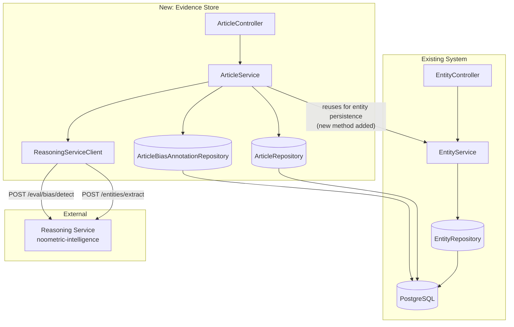

# Evidence Store Foundation Brownfield Enhancement Architecture

**Document Version:** 0.1
**Created:** 2026-07-02
**Author:** Winston (Architect) / Steve Kosuth-Wood
**Status:** Draft
**Template:** brownfield-architecture-template-v2

---

## Introduction

This document outlines the architectural approach for enhancing NewsAnalyzer with the Evidence Store Foundation — persisted article storage, entity-to-article linkage, and integration with the existing (but previously production-unused) `/eval/bias/detect` endpoint. It supplements the existing project architecture rather than replacing it; where new and existing patterns could conflict, this document resolves that in favor of consistency with what's already there.

**Relationship to Existing Architecture:** This document supplements existing project architecture by defining how new components integrate with current systems. Where conflicts arise between new and existing patterns, this document provides guidance on maintaining consistency while implementing the enhancement.

### Existing Project Analysis

- **Primary Purpose:** NewsAnalyzer is a public AI-evaluation showcase — entity extraction, cognitive bias detection, and structured government reference data (the Factbase), demonstrating Noometric's evaluation methodology in production.
- **Current Tech Stack:** Java 17 / Spring Boot 3.2.2 (backend), Next.js 14 / React 18 (frontend), Python 3.11 / FastAPI (reasoning service, private repo), PostgreSQL 15 with JSONB, Flyway migrations, Redis available, Docker Compose (dev + Hetzner production), full OTel/Prometheus/Loki/Tempo/Grafana observability.
- **Architecture Style:** Three independently deployable services (backend, frontend, reasoning-service) communicating over documented REST contracts, each internally a layered structure (controller/service/repository/model in the backend). A monolith-per-service pattern — the Factbase-expansion precedent explicitly chose "monolith-first" for new backend work over a new service, since a manually/scheduler-triggered job doesn't need independent scaling. The same reasoning applies here, even more strongly, since MVP ingestion is manual/API-triggered, not scheduled at all.
- **Deployment Method:** Docker Compose, GHCR-published images pulled in production, Hetzner Cloud hosting, GitHub Actions CI/CD.

**Available Documentation:**
- `docs/architecture/{coding-standards,tech-stack,source-tree}.md`
- `docs/architecture/FACTBASE_EXPANSION_ARCHITECT_HANDOFF.md`
- `docs/api/reasoning-service-contract.md`
- `docs/prd/ES-1.md`
- `docs/brief.md`, `docs/brainstorming-session-results.md`

**Identified Constraints:**
- IP boundary (CLAUDE.md): no reasoning/scoring *methodology* may be implemented in this repo — only consumption of the documented, stable reasoning-service contract
- `REASONING_SERVICE_URL` contract (`/entities/extract`, `/eval/bias/detect`) must remain unchanged (PRD CR4)
- Schema changes must be additive-only (PRD CR2); new `Entity.article_id` FK must be nullable (PRD CR1)
- No UI scope this phase (PRD CR3)
- `docs/prd/ADMIN-1.md` (at the time this was written, still `docs/prd.md`) and the `docs/architecture/` shard directory are already in active use by unrelated/parallel work — this document uses a distinct filename to avoid collision
- **Verified directly against the codebase (not assumed):** there is no existing Java-side HTTP client to the reasoning service. The current `/entities/extract` call is proxied directly from Nginx to the reasoning service (`/api/eval/extract/spacy` → `http://reasoning/entities/extract`), called by the eval harness — `EntityController`/`EntityService` only ever perform CRUD on already-created `Entity` rows. This enhancement builds the first Java-side reasoning-service caller.
- **Verified directly against the codebase:** `SecurityConfig.java` runs `permitAll()` on every request in both dev and prod (JWT auth is a documented `TODO`, not yet implemented) — the entire API is currently unauthenticated, not just this enhancement's new endpoints.

### Change Log

| Change | Date | Version | Description | Author |
|---|---|---|---|---|
| Initial draft | 2026-07-02 | 0.1 | Created from `docs/prd/ES-1.md` | Winston (Architect) / Steve Kosuth-Wood |
| PO validation fixes | 2026-07-02 | 0.2 | Added rollback triggers/thresholds; documented duplicate-submission behavior; added rate-limit-confirmation prerequisite to Story Manager Handoff | Sarah (PO) / Steve Kosuth-Wood |

---

## Enhancement Scope and Integration Strategy

**Enhancement Overview**
- **Enhancement Type:** New Feature Addition + Integration with New Systems
- **Scope:** Backend-only. New `Article` persistence, `Entity`-to-`Article` linkage, dual reasoning-service integration (extraction + bias-detection), a grounded-query interface, and an eval-harness real-article path.
- **Integration Impact:** Moderate — additive schema changes, one new controller/service/repository triad, zero behavioral change to existing endpoints, no new deployable service.

**Integration Approach**
- **Code Integration Strategy:** New classes slot into the existing package structure (`model/repository/service/controller/dto`), mirroring the `Entity`/`EntityService`/`EntityController` pattern. No new microservice — a deliberate "monolith-first" call, matching the Factbase-expansion precedent's reasoning.
- **Database Integration:** Additive Flyway migrations creating `articles` and `article_bias_annotations` tables, plus a nullable `article_id` FK column on `entities`. Nothing about existing tables is removed or narrowed.
- **API Integration:** New `/api/articles` resource family following existing `@RestController`/`@Tag`/constructor-injection conventions. `/api/entities` and `/api/government-orgs` are untouched.
- **UI Integration:** None — no UI component to this enhancement.

**Compatibility Requirements**
- **Existing API Compatibility:** All current `/api/entities` request/response shapes stay unchanged; `articleId` becomes an additive, nullable field on `EntityDTO` (defaults to `null` for non-article-sourced entities).
- **Database Schema Compatibility:** Additive-only migrations; no destructive `ALTER`s; existing rows unaffected.
- **UI/UX Consistency:** N/A this phase.
- **Performance Impact:** The new ingestion path adds two sequential outbound HTTP calls per article, fully isolated to the new `/api/articles` flow — zero performance impact on `/api/entities`, `/api/government-orgs`, or the frontend.

---

## Tech Stack

### Existing Technology Stack

| Category | Current Technology | Version | Usage in Enhancement | Notes |
|---|---|---|---|---|
| Backend Language | Java | 17 | All new classes (`Article` model/repo/service/controller, `ReasoningServiceClient`) | No change |
| Backend Framework | Spring Boot | 3.2.2 | New REST controller, JPA entities, transactional services | No change |
| HTTP Client | `RestTemplate` (via `RestTemplateBuilder`) | Spring-managed | New `ReasoningServiceClient` calling `/entities/extract` and `/eval/bias/detect` directly | Mirrors the **verified, actual** `CongressApiClient` implementation (configured timeouts, manual retry) — not the `@Retryable`/`@CircuitBreaker` style proposed (but not implemented) in the Factbase handoff doc |
| Database | PostgreSQL | 15 | New `articles`, `article_bias_annotations` tables; nullable FK on `entities` | JSONB available for flexible annotation metadata |
| Schema Migration | Flyway | existing versioning | New additive migration file(s) | Follows `V{n}__{description}.sql` convention |
| Caching | Redis / Caffeine (in-memory) | existing | Not used — MVP ingestion is manual/low-volume, no rate-limited external API in this path | N/A this phase |
| API Docs | springdoc-openapi (Swagger) | existing | New `/api/articles` endpoints annotated | No change |
| Observability | OpenTelemetry + Prometheus + Loki + Tempo + Grafana | existing | New ingestion path traced/logged via existing instrumentation | No change |
| Testing | JUnit 5 + Mockito (Spring Boot Test) | existing | New `Article*Test` classes | No change |

**New Technology Additions:** None required. Everything needed already exists in the stack — a deliberate "boring technology" choice appropriate for MVP's manual, low-volume ingestion pattern.

---

## Data Models and Schema Changes

### New Data Model: Article

**Purpose:** Persisted record of an ingested news article — the source-attributed evidence at the center of this enhancement.

**Integration:** Referenced by `Entity` (nullable FK) and by `ArticleBiasAnnotation` (FK).

**Key Attributes:**
- `id`: UUID — primary key
- `sourceName`: VARCHAR — outlet/publication name
- `url`: VARCHAR — source URL
- `publicationDate`: TIMESTAMP — original publication time
- `rawText`: TEXT — full article text
- `ingestedAt`: TIMESTAMP — when NewsAnalyzer ingested it
- `extractionStatus`: VARCHAR-backed enum (`PENDING` \| `SUCCESS` \| `FAILED`)
- `biasDetectionStatus`: VARCHAR-backed enum, same values — tracked **separately** from `extractionStatus` so the two failure modes remain distinguishable
- `reliabilityScore`: FLOAT, nullable — the deferred cross-article aggregation field (PRD FR7), always `null` at MVP

**Relationships:** One `Article` → many `Entity` (via `entity.article_id`); one `Article` → many `ArticleBiasAnnotation`

### New Data Model: ArticleBiasAnnotation

**Purpose:** Structured storage for each individual bias/fallacy annotation returned by `/eval/bias/detect` (PRD FR6) — raw signal, not yet aggregated.

**Integration:** FK to `Article`.

**Key Attributes:**
- `id`: UUID
- `articleId`: FK → `articles.id`
- `distortionType`: VARCHAR — snake_case ontology identifier, stored as-is from the contract response
- `category`: VARCHAR — `cognitive_bias` \| `logical_fallacy`
- `excerpt`: TEXT, `explanation`: TEXT, `confidence`: FLOAT
- `ontologyMetadata`: JSONB — `definition`/`academic_source`/`detection_pattern` as one flexible blob, matching the existing `Entity.properties`/`schemaOrgData` JSONB pattern

**Relationships:** Many `ArticleBiasAnnotation` → one `Article`

### Schema Integration Strategy

**Database Changes Required:**
- **New Tables:** `articles`, `article_bias_annotations`
- **Modified Tables:** `entities` — add nullable `article_id UUID` FK column
- **New Indexes:** `idx_articles_source_name`, `idx_articles_publication_date`, `idx_article_bias_annotations_article_id`, `idx_entities_article_id`
- **Migration Strategy:** Two separate additive migrations, mirroring the exact historical precedent of `V3__create_government_organizations.sql` followed by `V4__add_entity_gov_org_link.sql`:
  1. `V{next}__create_articles.sql` — creates `articles` and `article_bias_annotations`
  2. `V{next+1}__add_entity_article_link.sql` — adds the nullable `article_id` FK to `entities`

  *(Do not hardcode `{next}` — confirm the actual latest migration number in `backend/src/main/resources/db/migration/` at implementation time; `source-tree.md` only documents through `V4`, and the repo has moved on since.)*

**Backward Compatibility:**
- `entity.article_id` is nullable, defaults to `NULL` — every existing `Entity` row is valid immediately, no backfill required
- `entity.source` (existing freeform string field) is untouched
- No existing table is narrowed, renamed, or has a column removed

**Duplicate Submissions** *(decided during PO validation)*: No uniqueness constraint on `articles` (e.g., on `url`) at MVP — resubmitting the same article creates a new row. Deduplication requires deciding what "duplicate" means (URL match? text-hash match? URL+publicationDate?), which is a real design question deferred to Phase 2 rather than rushed here, especially given MVP's low, manual ingestion volume.

---

## Component Architecture

**ArticleController**
- **Responsibility:** REST endpoints for `/api/articles` (create, retrieve, grounded-query)
- **Integration Points:** Delegates entirely to `ArticleService`
- **Key Interfaces:** `POST /api/articles`, `GET /api/articles/{id}`, `GET /api/articles/query`
- **Dependencies:** New — `ArticleService`
- **Tech:** Spring `@RestController`, mirrors `EntityController`

**ArticleService**
- **Responsibility:** Orchestrates the ingestion pipeline — persist `Article` → call `ReasoningServiceClient.extractEntities()` → persist linked `Entity` records → call `ReasoningServiceClient.detectBias()` → persist `ArticleBiasAnnotation` records. Also implements the grounded-query logic.
- **Integration Points:** Calls the *existing* `EntityService` (not `EntityRepository` directly) to create entities from extraction results, reusing `EntityService`'s existing validation and `SchemaOrgMapper` logic. `EntityService` gains one small new method (accepting an `articleId`) — not a rewrite, and the public `/api/entities` surface doesn't change.
- **Dependencies:** New — `ArticleRepository`, `ArticleBiasAnnotationRepository`, `ReasoningServiceClient`. Existing — `EntityService` (reused, lightly extended).
- **Tech:** Spring `@Service`

  > **⚠️ Must-fix, found during architect-checklist review:** Do **not** wrap the entire pipeline in a single `@Transactional` method, even though that matches the surface-level convention seen in `EntityService`. The pipeline includes two external HTTP calls with up to a 30s and 60s timeout respectively — holding a single DB transaction (and its connection) open across ~90 seconds of network I/O risks connection-pool exhaustion under any concurrent load, and produces messy semantics if the process crashes mid-call. Structure this instead as **separate, short transactional boundaries**: (1) a `@Transactional` step that persists the `Article` and commits, (2) a non-transactional call to `ReasoningServiceClient.extractEntities()`, (3) a separate short `@Transactional` step that persists the resulting `Entity` records and updates `extractionStatus`, (4) a non-transactional call to `ReasoningServiceClient.detectBias()`, (5) a separate short `@Transactional` step that persists `ArticleBiasAnnotation` records and updates `biasDetectionStatus`. Each DB write is committed independently; only the external calls sit outside any transaction.

**ReasoningServiceClient** *(new — first Java-side reasoning-service caller, verified against the codebase)*
- **Responsibility:** Encapsulates all HTTP communication with the reasoning service for this enhancement — both `/entities/extract` and `/eval/bias/detect`, including `X-Noometric-API-Key` header injection and the documented 30s/60s timeout budgets.
- **Integration Points:** Called by `ArticleService` only, at MVP scope
- **Key Interfaces:** `extractEntities(text, confidenceThreshold)`, `detectBias(text, grounded)`
- **Dependencies:** None existing to build on — mirrors `CongressApiClient`'s actual implementation shape (`RestTemplate` via `RestTemplateBuilder`, configured timeouts, manual retry)

**ArticleRepository / ArticleBiasAnnotationRepository**
- **Responsibility:** Spring Data JPA repositories for the two new tables
- **Tech:** `JpaRepository`, mirroring `EntityRepository`/`GovernmentOrganizationRepository`

### Component Interaction Diagram



---

## API Design and Integration

**API Integration Strategy:** New `/api/articles` resource family, RESTful, following the `@RestController`/`@Tag`/`@Operation`/`ResponseEntity<DTO>` conventions already used by `EntityController`. No API versioning — matches the existing project convention.

**Authentication:** None — matches the current (unauthenticated, JWT-planned-but-not-built) posture of every existing endpoint, verified directly against `SecurityConfig.java`. This is flagged explicitly, not silently inherited: `/api/articles` triggers cost-bearing LLM calls per request, a materially different risk class than plain CRUD. See Security Integration below for the mitigation.

**Versioning:** Not applicable.

### New Endpoints

**Create Article**
- **Method:** `POST` — **Endpoint:** `/api/articles`
- **Purpose:** Submit and persist a new article; triggers the ingestion pipeline (extraction + bias detection)

Request:
```json
{
  "sourceName": "CNN",
  "url": "https://example.com/article",
  "publicationDate": "2026-06-30T14:00:00Z",
  "rawText": "Full article text..."
}
```

Response:
```json
{
  "id": "5c2f...-uuid",
  "sourceName": "CNN",
  "url": "https://example.com/article",
  "publicationDate": "2026-06-30T14:00:00Z",
  "ingestedAt": "2026-07-02T09:15:00Z",
  "extractionStatus": "SUCCESS",
  "biasDetectionStatus": "SUCCESS",
  "reliabilityScore": null,
  "entityCount": 5,
  "annotationCount": 2
}
```

**Get Article by ID**
- **Method:** `GET` — **Endpoint:** `/api/articles/{id}`
- **Purpose:** Retrieve a persisted article with its linked entities and bias annotations

Response: same shape as above, with nested `entities: [...]` and `biasAnnotations: [...]` arrays.

**Grounded Query** *(the "zero silent blending" endpoint — PRD Story 1.5 / NFR4)*
- **Method:** `GET` — **Endpoint:** `/api/articles/query?term={term}`
- **Purpose:** Query the Evidence Store for grounded evidence; returns either cited results or an explicit "not found"

Response (evidence found):
```json
{
  "grounded": true,
  "results": [
    {
      "articleId": "5c2f...-uuid",
      "sourceName": "CNN",
      "excerpt": "...",
      "entities": [{ "id": "...", "name": "EPA", "entityType": "GOVERNMENT_ORG" }],
      "biasAnnotations": [{ "distortionType": "hasty_generalization", "confidence": 0.87 }]
    }
  ]
}
```

Response (no evidence found):
```json
{
  "grounded": false,
  "message": "No grounded evidence found for this query.",
  "results": []
}
```

The `grounded` boolean as a mandatory top-level field is the actual enforcement mechanism for "never silently blend" — a consumer must explicitly check it rather than inferring groundedness from whether `results` is empty.

---

## Source Tree

New files slot directly into the existing package structure — no new top-level folders (MVP ingestion is manual/API-driven, not a scheduled sync job, so it doesn't warrant a dedicated `ingestion/` package the way the Factbase sync jobs did).

```
{project-root}/
├── backend/src/main/java/org/newsanalyzer/
│   ├── controller/
│   │   ├── EntityController.java              # Existing
│   │   └── ArticleController.java              # NEW — /api/articles endpoints
│   ├── dto/
│   │   ├── EntityDTO.java                       # Existing
│   │   ├── ArticleDTO.java                      # NEW
│   │   ├── CreateArticleRequest.java            # NEW
│   │   └── ArticleBiasAnnotationDTO.java        # NEW
│   ├── model/
│   │   ├── Entity.java                          # Existing — MODIFIED (add nullable articleId FK)
│   │   ├── Article.java                         # NEW
│   │   ├── ArticleBiasAnnotation.java           # NEW
│   │   ├── ArticleStatus.java                   # NEW — enum (PENDING/SUCCESS/FAILED)
│   │   └── converter/
│   │       └── ArticleStatusConverter.java      # NEW — mirrors OrganizationTypeConverter pattern
│   ├── repository/
│   │   ├── EntityRepository.java                # Existing
│   │   ├── ArticleRepository.java               # NEW
│   │   └── ArticleBiasAnnotationRepository.java # NEW
│   └── service/
│       ├── EntityService.java                   # Existing — MODIFIED (new method for article-linked entity creation)
│       ├── CongressApiClient.java               # Existing (pattern reference only)
│       ├── ArticleService.java                  # NEW
│       └── ReasoningServiceClient.java          # NEW
├── backend/src/main/resources/db/migration/
│   ├── V{next}__create_articles.sql             # NEW
│   └── V{next+1}__add_entity_article_link.sql   # NEW
└── backend/src/test/java/org/newsanalyzer/
    ├── controller/ArticleControllerTest.java    # NEW
    ├── model/ArticleTest.java                   # NEW
    ├── repository/ArticleRepositoryTest.java    # NEW
    └── service/ArticleServiceTest.java          # NEW
```

**Integration Guidelines**
- **File Naming:** PascalCase, `Article*` prefix, matching the existing `Entity*` naming exactly
- **Folder Organization:** No new top-level packages
- **Import/Export Patterns:** Standard ordering per `coding-standards.md`

---

## Infrastructure and Deployment Integration

**Existing Infrastructure**
- **Current Deployment:** Docker Compose for dev (`deploy/dev/docker-compose.yml`) and production (`deploy/production/docker-compose.yml`, GHCR images), Hetzner Cloud, Nginx.
- **Infrastructure Tools:** Docker Compose, GitHub Actions CI/CD, Nginx, full OTel/Prometheus/Loki/Tempo/Grafana stack.
- **Environments:** `dev` (local Docker Desktop) and production (Hetzner).

**Enhancement Deployment Strategy**
- **Deployment Approach:** No new deployment artifact — new classes compile into the existing backend image, ship through the existing deploy path.
- **Infrastructure Changes:** None — no new environment variables, no new Nginx routes. Flyway migration runs automatically on backend startup.
- **Pipeline Integration:** New test classes are automatically picked up by the existing `mvn test` CI step.

**Rollback Strategy**
- **Rollback Method:** Standard image rollback. Because migrations are additive-only, rolling back application code does not require a down-migration — new tables and the nullable FK simply go unused by the older code.
- **Risk Mitigation:** Best-effort bias detection (NFR2) and explicit failure-state tracking (NFR3) mean a reasoning-service outage degrades gracefully rather than causing ingestion-wide failure. The feature is fully isolated, so a bad deploy can be rolled back without risk to `/api/entities` or `/api/government-orgs` availability.
- **Rollback Triggers and Thresholds** *(added during PO validation — previously undefined)*:
  - Roll back immediately if the existing `/api/entities` or `/api/government-orgs` error rate increases measurably post-deploy (any regression here indicates the additive migration or the `EntityService` extension broke something, and is never expected).
  - Roll back if `Article` ingestion (`extractionStatus` or `biasDetectionStatus` = `FAILED`) exceeds a 50% failure rate over a rolling 15-minute window with at least 5 attempts — a threshold this high specifically because bias-detection failure is best-effort and should NOT by itself trigger rollback; this threshold is tuned to catch a broken deploy (e.g., a bad `ReasoningServiceClient` config), not normal best-effort degradation.
  - No automatic rollback — given MVP's manual/low-volume ingestion, these are alerting thresholds that page a human to decide, not an automated rollback trigger.
- **Monitoring:** Reuses the existing observability stack — add ingestion success/failure counters and bias-detect latency histograms to the existing dashboard pattern.

---

## Coding Standards

**Existing Standards Compliance**
- **Code Style:** 4-space indentation, 120-char lines, K&R braces — per `coding-standards.md`
- **Linting Rules:** IDE default / Checkstyle
- **Testing Patterns:** JUnit 5 + Mockito, Given/When/Then structure
- **Documentation Style:** JavaDoc explaining *why*, not *what*

**Enhancement-Specific Standards**
- **Reasoning-Service Client Pattern:** Any future Java-side caller of the private reasoning service should follow the `ReasoningServiceClient` shape established here (`RestTemplate` via `RestTemplateBuilder`, configured timeouts, manual retry, `X-Noometric-API-Key` header, one method per contract endpoint) — this is now the reference implementation.
- **Partial-Failure Status Tracking:** Multi-step pipelines calling multiple external services should track each step's outcome in its own explicitly-named status field (as with `extractionStatus`/`biasDetectionStatus`), not a single generic flag.
- **Transaction Boundary Discipline:** Any service method invoking an external HTTP call must not share a `@Transactional` boundary with that call — see the must-fix guidance under Component Architecture. Persistence steps are transactional and short; external calls are not.

**Critical Integration Rules**
- **Existing API Compatibility:** No modification to existing `/api/entities` response shapes beyond the additive, nullable `articleId` field.
- **Database Integration:** All schema changes via additive Flyway migrations only.
- **Error Handling:** New exceptions follow the existing `EntityNotFoundException` pattern, handled via the existing `@ControllerAdvice` `GlobalExceptionHandler`.
- **Logging Consistency:** SLF4J per existing convention. INFO for successful ingestion steps, WARN for best-effort failures, ERROR reserved for failures that actually block the request.

---

## Testing Strategy

**Integration with Existing Tests**
- **Existing Test Framework:** JUnit 5 + Mockito + Spring Boot Test
- **Test Organization:** Mirrors the main source tree
- **Coverage Requirements:** No formal numeric threshold documented anywhere in this project; match the existing informal standard (success + validation failure + not-found paths, as seen in `EntityServiceTest`)

**New Testing Requirements**

*Unit Tests for New Components*
- **Framework:** JUnit 5 + Mockito
- **Location:** `backend/src/test/java/org/newsanalyzer/{controller,model,repository,service}/Article*Test.java`
- **Coverage Target:** Match existing informal standard
- **Integration with Existing:** `ReasoningServiceClient` tests mock the HTTP layer (Mockito or `MockRestServiceServer`), matching this project's existing mock-vs-live testing discipline (`ADR-QA-003`)

*Integration Tests*
- **Scope:** Full ingestion pipeline end-to-end, plus the bias-detection failure-simulation test required by PRD Story 1.4 AC6
- **Existing System Verification:** Full existing `EntityControllerTest`/`EntityServiceTest`/`GovOrg*` suite must continue passing unchanged — the automated check for IV1 across all six PRD stories
- **New Feature Testing:** `api-tests` (REST Assured) is marked "planned" (Epic QA-1), not active — an `ArticleCrudTest` there is optional/deferred, not an MVP requirement

*Regression Testing*
- **Existing Feature Verification:** Full existing `mvn test` suite passes unchanged before and after
- **Automated Regression Suite:** New tests join the existing CI suite; no separate suite needed
- **Manual Testing Requirements:** One manual end-to-end ingestion of a real test article, per PRD Story 1.6

---

## Security Integration

**Existing Security Measures**
- **Authentication:** None — verified directly against `SecurityConfig.java` (`permitAll()` in both dev and prod, JWT is a documented `TODO`)
- **Authorization:** None
- **Data Protection:** Bean Validation on DTOs; secrets via environment variables
- **Security Tools:** Spring Security CSRF (disabled) / CORS (permissive in dev, disabled in prod); no WAF or rate limiting currently

**Enhancement Security Requirements**

`POST /api/articles` is unauthenticated, matching the rest of the API, but unlike existing endpoints it triggers an LLM-backed, cost-bearing downstream call (`/eval/bias/detect`) — a materially new risk class versus plain CRUD.

> **⚠️ Must-fix, found during architect-checklist review:** A `rawText` size cap alone is insufficient — it doesn't stop repeated valid-sized requests from running up LLM spend. Add **basic rate limiting** to `/api/articles` (e.g., a simple per-IP or global requests-per-minute cap, implementable with a lightweight in-memory limiter — no new infrastructure needed given MVP's manual/low-volume scope) alongside the size cap. Full JWT auth remains out of scope for this enhancement (a system-wide gap, not something this feature should fix alone), but this endpoint's specific cost-abuse exposure needs its own guard.

- **New Security Measures:** `rawText` length cap (Bean Validation `@Size`) + basic rate limiting on `/api/articles`, both enforced before any reasoning-service call is made
- **Integration Points:** Backend-to-reasoning-service leg is already authenticated via `X-Noometric-API-Key`; the exposure is specifically the public-facing ingestion endpoint
- **Compliance Requirements:** Article full-text copyright/retention question (PRD NFR5) is cross-referenced here, not resolved — needs `business-attorney` input per the PRD's next steps before real content ingestion scales up
- **To verify before production use:** confirm `REASONING_SERVICE_URL` uses TLS in production — not confirmed in the documents reviewed for this architecture

**Security Testing**
- **Existing Security Tests:** None found
- **New Security Test Requirements:** Tests asserting both the size cap and the rate limit are enforced and return appropriate error responses (400/429) without reaching the reasoning-service call
- **Penetration Testing:** Not warranted at this scope; revisit when system-wide JWT auth work happens

---

## Checklist Results Report

**Overall Architecture Readiness: Medium-High.** Solid grounding in verified codebase facts (not assumptions) and strong pattern consistency with existing conventions. Two must-fix issues were identified during review and have been incorporated directly into this document (Component Architecture's transaction-boundary guidance; Security Integration's rate-limiting requirement) rather than left as open findings.

**Project Type:** Backend-only. Frontend-specific checklist sections (3.2, 4.x, 7.3, 10.x) were skipped as not applicable.

### Section Pass Rates

| Section | Pass Rate | Key Gaps |
|---|---|---|
| 1. Requirements Alignment | 80% | FR8 (eval harness reading real `Article` data) — access mechanism (REST API vs. direct DB read) not decided |
| 2. Architecture Fundamentals | 85% (was lower before fix) | Transaction-boundary risk — resolved in this revision |
| 3. Technical Stack & Decisions | 90% | Backend scaling approach is thin — acceptable given explicit MVP scope |
| 5. Resilience & Operational Readiness | 65% | No circuit breaker for reasoning-service calls; "retriable" (NFR3) asserted but no retry-triggering mechanism designed; no alerting thresholds defined |
| 6. Security & Compliance | 70% (was lower before fix) | Rate-limiting gap resolved in this revision; encryption-at-rest and access audit trail still unaddressed (likely inherits undocumented infra posture) |
| 7. Implementation Guidance | 80% | No ADR entries despite this project's established `docs/architecture/adr/` practice |
| 8. Dependency & Integration Mgmt | 80% | Reasoning-service rate limits/quotas on the receiving end are unconfirmed |
| 9. AI Agent Implementation Suitability | 85% | Transaction-boundary pitfall is exactly the kind of implicit trap that needed explicit callout — now addressed |

### Risk Assessment (top 5, resolved status noted)

1. ~~**HIGH** — Transaction boundary risk~~ → **Resolved** in Component Architecture and Coding Standards
2. ~~**HIGH** — No rate limiting on cost-bearing endpoint~~ → **Resolved** in Security Integration
3. **MEDIUM** (open) — No retry mechanism actually designed despite NFR3 asserting "retriable." Recommendation: explicitly scope as Phase 2, don't imply it's handled at MVP.
4. **MEDIUM** (open) — No circuit breaker for reasoning-service calls. Tolerable at MVP's manual/low-volume scope; revisit before Phase 2's automated ingestion.
5. **LOW-MEDIUM** (open) — Encryption-at-rest and access audit trail unaddressed. Recommend explicit confirmation of underlying infra posture rather than silent inheritance, given the copyright-sensitivity of stored article text.

### Recommendations

**Must-fix:** Both applied directly to this document (transaction boundaries; rate limiting).

**Should-fix:**
- Confirm `REASONING_SERVICE_URL` uses TLS in production
- Add a sequence diagram for the ingest→extract→bias-detect→persist flow (this document currently has only a static component diagram)
- Add ADR entries for the two significant new decisions (Java-side reasoning-service client shape; monolith-first), per this project's existing ADR practice
- Define alerting thresholds for the new failure-rate metrics

**Nice-to-have (defer to Phase 2):**
- Circuit breaker for reasoning-service calls
- Actual retry-triggering mechanism for failed extraction/bias-detection
- Load/performance testing requirements

---

## Next Steps

### Story Manager Handoff

This architecture document provides the technical blueprint for `docs/prd/ES-1.md`'s Epic 1 (6 stories). Key integration requirements validated during this design session: monolith-first (no new service), nullable `article_id` FK for backward compatibility, additive-only Flyway migrations following the existing `V3`/`V4` two-step precedent, and a brand-new `ReasoningServiceClient` (the first Java-side caller of the reasoning service — verified directly against the codebase, not assumed). Two must-fix architectural constraints apply to story implementation: (1) `ArticleService`'s persistence steps and its external reasoning-service calls must not share a single `@Transactional` method; (2) `/api/articles` needs basic rate limiting, not just request-size validation. Start with Story 1.1 (Article Persistence Model) — its Integration Verification steps are the concrete checkpoints confirming existing `Entity` functionality stays intact before any subsequent story builds on top of it. **Before Story 1.4 begins**, confirm with `noometric-intelligence` whether `/eval/bias/detect` has an undocumented rate limit or quota — this story is that endpoint's first production caller, and the contract doc doesn't state one (flagged during PO validation).

### Developer Handoff

Reference this architecture document and `docs/architecture/coding-standards.md` together. `ReasoningServiceClient` should mirror the actual, verified `CongressApiClient` implementation — not the `@Retryable`/`@CircuitBreaker` style proposed (but never implemented) in `FACTBASE_EXPANSION_ARCHITECT_HANDOFF.md`. Every story's Integration Verification steps are compatibility checkpoints, not optional — IV1 in particular must be re-confirmed after each story, not just once at the end. Implement in the PRD's story order (1.1 → 1.6); each story is sized to be independently verifiable before the next begins.
